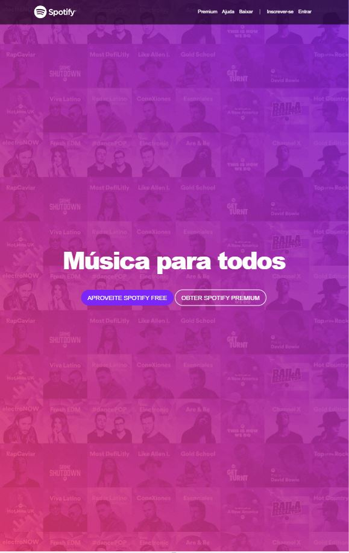
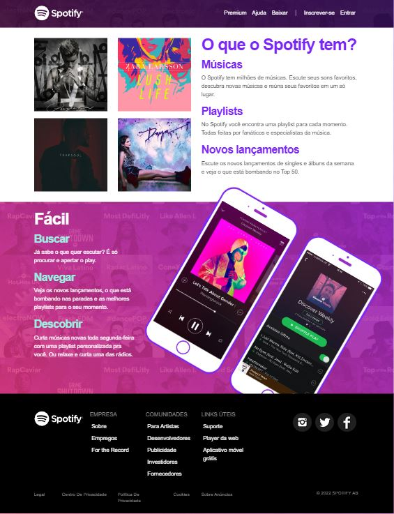

<h1 align="center"> Clone Spotify </h1>

Projeto pessoal de um clone do Spotify, sem fins lucrativos. 

<<<<<<< HEAD

  <a href="#tecnologias">Tecnologias</a>&nbsp;&nbsp;&nbsp;|&nbsp;&nbsp;&nbsp;
  <a href="#projeto">Projeto</a>&nbsp;&nbsp;&nbsp;|&nbsp;&nbsp;&nbsp;

 

  

  

## Tecnologias

Esse projeto foi desenvolvido com as seguintes tecnologias:

- HTML
- CSS
- JavaScript
- Git e Github

## Projeto

Spotify é um serviço de streaming de música, podcast e rádios.
=======
https://jorge-saraiva.github.io/clone-spotify/
